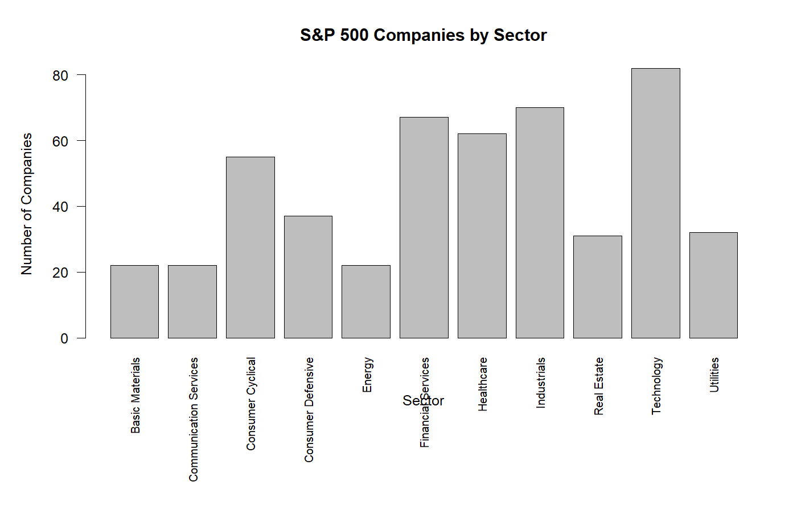
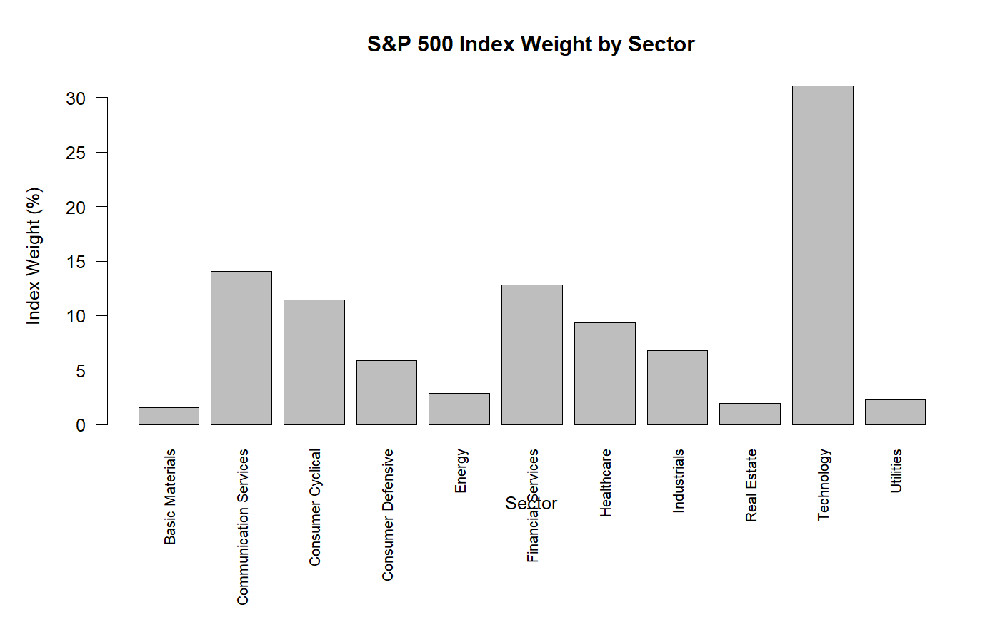
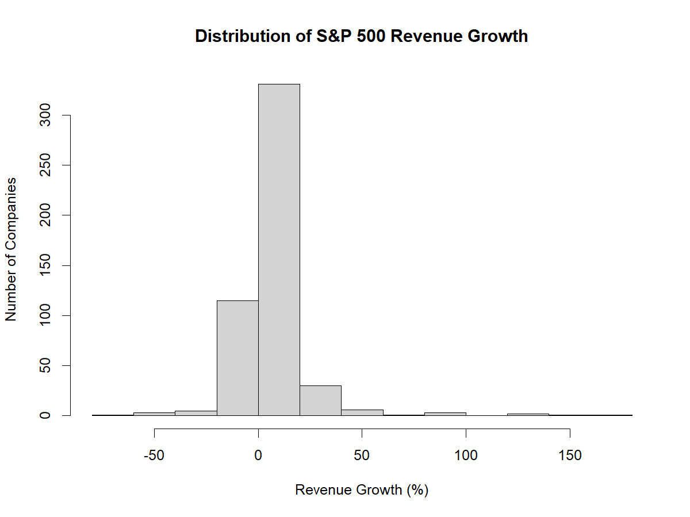
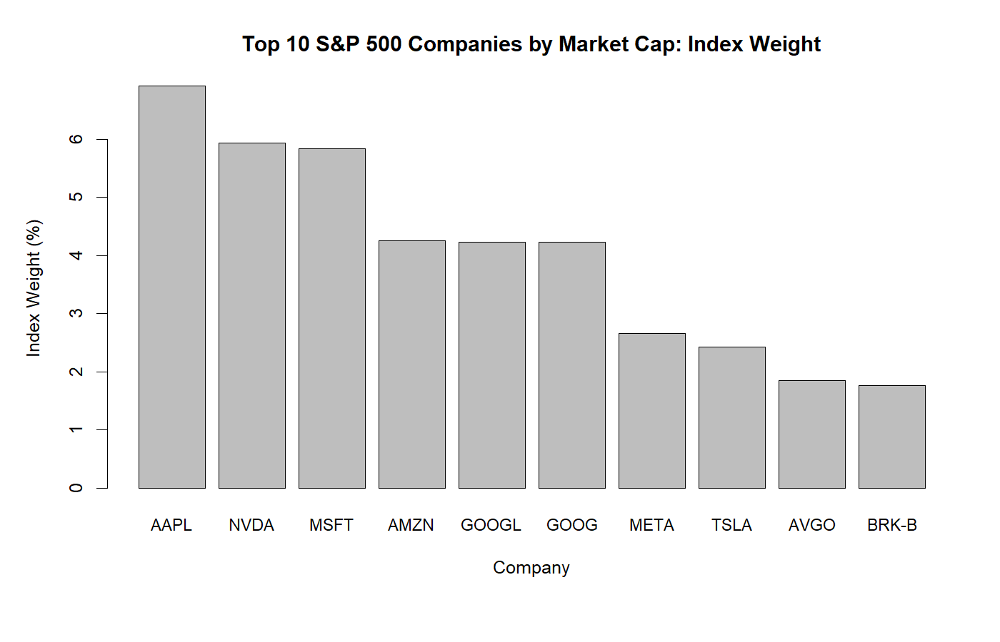

# S&P 500 Constituent Analysis

A financial data analysis project using **Base R** to explore the composition, concentration, sector representation, revenue growth, and statistical characteristics of S&P 500 constituents.

## Project Overview

This project analyzes **502 S&P 500 companies** across **11 sectors and 114 industries**.

The analysis examines:

- Sector and industry composition
- Sector representation vs. index weight
- Market capitalization
- Index concentration
- Revenue growth
- Revenue growth by sector
- Market capitalization vs. revenue growth
- Revenue-growth outliers
- Financial data visualization

## Tools

- **R**
- **Base R**
- CSV data
- Descriptive statistics
- Correlation analysis
- IQR-based outlier detection

No external R packages are required.

## Key Findings

### Index Concentration

The **5 largest companies by market capitalization** account for:

**27.18% of S&P 500 index weight**

The **10 largest companies** account for:

**40.12% of index weight**

This highlights the concentration of the market-cap-weighted index among its largest constituents.

### Sector Composition

**Technology** has the largest number of constituents:

**82 companies (16.33%)**

It also has the largest index weight:

**31.10%**

This demonstrates that company count and index representation can differ substantially because the S&P 500 is weighted by market capitalization.

### Revenue Growth

| Metric | Result |
|---|---:|
| Mean | 7.05% |
| Median | 5.10% |
| Standard Deviation | 18.02% |
| IQR | 10.70% |

Revenue growth varies considerably across companies, with substantial differences between individual constituents.

### Revenue-Growth Outliers

Using the **1.5 × IQR method**, the analysis identified:

**42 revenue-growth outliers**

The outlier boundaries were:

- Lower bound: **−15.85%**
- Upper bound: **26.95%**

Both unusually high and unusually low revenue-growth observations were identified.

### Market Capitalization vs. Revenue Growth

The Pearson correlation was:

**r = 0.164**

This indicates a **weak positive relationship** between market capitalization and revenue growth in the dataset.

## Visualizations

### Companies by Sector



### Index Weight by Sector



### Revenue Growth Distribution



### Top 10 Companies by Market Capitalization



### Extreme Revenue Growth Outliers


## Project Structure

```text
S&P500-Base-R-Analysis/
│
├── data/
│   └── SP500.csv
│
├── figures/
│   ├── sector_companies.png
│   ├── sector_index_weight.png
│   ├── revenue_growth_distribution.png
│   ├── top10_index_weight.png
│   └── extreme_revenue_growth_outliers.png
│
├── S&P500_Analysis.R
└── README.md
Methodology

The analysis follows a structured workflow:

Data quality assessment
Sector and industry analysis
Sector weight calculation
Market-cap ranking
Index concentration analysis
Revenue-growth analysis
Sector-level revenue-growth comparison
Correlation analysis
IQR-based outlier detection
Base R visualization
Reproducibility

The analysis can be reproduced by opening S&P500_Analysis.R in RStudio and running the script from the project root.

The dataset should be located at:

data/SP500.csv

The script automatically generates the visualization files inside the figures/ directory.

Limitations
The dataset represents a single snapshot rather than a historical time series.
Revenue growth is analyzed cross-sectionally.
Correlation does not imply causation.
The analysis does not attempt to predict future stock performance.
Results depend on the specific dataset and its constituent snapshot.
Conclusion

The analysis demonstrates how Base R can be used to perform a complete exploratory financial data analysis.

The results highlight significant index concentration, differences between sector representation and index weighting, substantial variation in revenue growth, and a weak relationship between company size and revenue growth.
